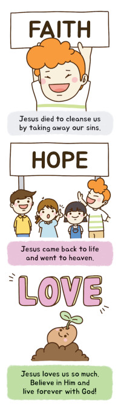

# Gospel Bookmark

Our evangelism approach uses cheerfully illustrated bookmarks that present the core message of Christianity in a simple, engaging way.
This special bookmark tells the complete story of God's love and salvation through Jesus Christ using six key concepts of the Gospel.

## Front Side: The Journey to Jesus

*Jesus answered, “I am the way and the truth and the life. No one comes to the Father except through me. - John 14:6*

**1. WAY - Creation** - *God created the world and made a way to Him*  
The story begins with God's original design. He created the world and humanity with the purpose of relationship and fellowship with Him.

**2. TRUTH - The Fall** - *But the truth is: sin separated us from God*  
Humanity chose to disobey God, and sin entered the world, breaking our relationship with our Creator and separating us from Him.

**3. LIFE - Salvation** - *God sent His only Son, Jesus, to save our lives*  
To restore what was broken, God sent Jesus as the way of salvation, which was His loving response to our fallen condition.

## Back Side: Living in Christ

*And now these three remain: faith, hope and love. But the greatest of these is love. - 1 Corinthians 13:13*

**4. FAITH - Redemption** - *Jesus died to cleanse us by taking away our sins*  
Jesus took our place on the cross, dying as the perfect sacrifice to pay the debts of our sins and redeem us back to God.

**5. HOPE - Resurrection** - *Jesus came back to life and went to heaven*  
Jesus conquered death by rising from the grave and ascending to heaven, proving His power over sin and death and giving us hope.

**6. LOVE - Eternal Life** - *Jesus loves us so much. Believe in Him and live forever with God!*  
Through faith in Jesus, we receive the gift of eternal life—living forever in God's loving presence, both now and in His eternal kingdom.

